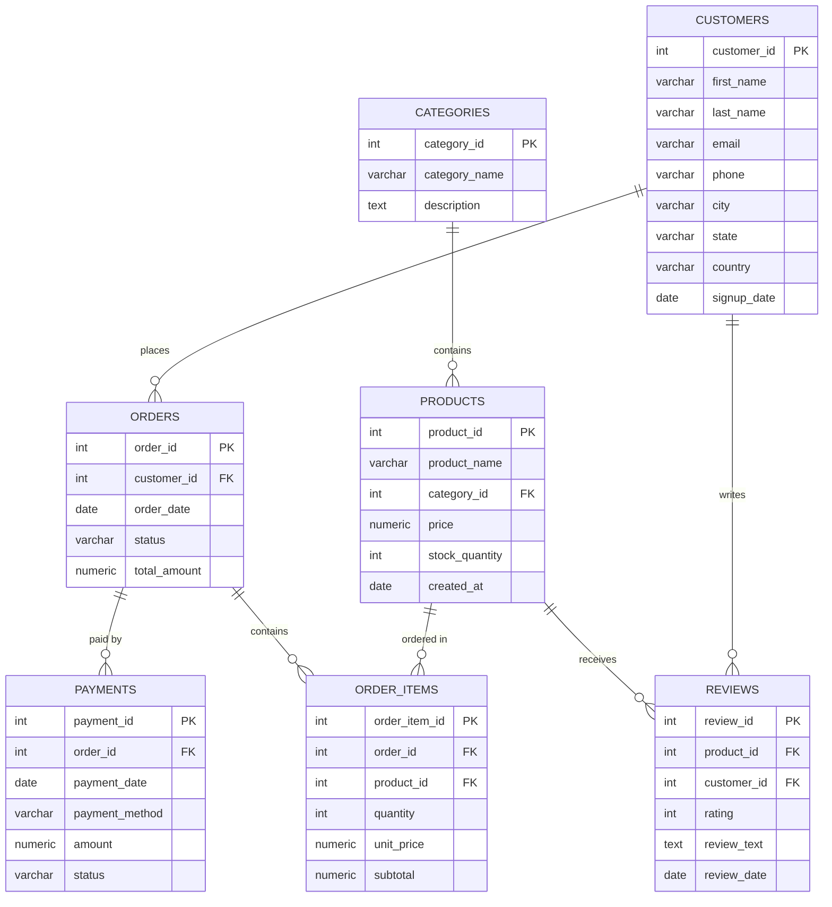

# 🛒 E-Commerce Analytics SQL Portfolio

A PostgreSQL portfolio project that models a simplified e-commerce platform — customers, product catalog, orders, payments, and reviews — and uses it to demonstrate practical SQL and database design skills, from schema design through analytics queries.

> **Status:** ✅ Complete — schema, sample data, views, indexes, materialized views, and 30+ analysis/interview-style queries are all in place and tested against PostgreSQL 16.

---

## 📖 Project Overview

This project simulates the backend database of a small online store. It's built to show the kind of SQL work a Data Analyst, Data Engineer, or backend-adjacent AI/ML Engineer does day to day: designing a normalized schema, loading realistic data, and writing queries that answer real business questions (top customers, revenue by category, repeat purchase rate, etc.).

The project is intentionally scoped like a strong student/portfolio project — realistic and well-documented, but not artificially over-engineered.

---

## 🧠 SQL Topics Covered

- Relational database design & normalization
- DDL: `CREATE TABLE`, data types, constraints
- Primary keys, foreign keys, `ON DELETE` behavior
- `CHECK` constraints and generated columns
- DML: bulk `INSERT` with realistic sample data
- Joins (`INNER JOIN`, `LEFT JOIN`)
- Aggregate functions & `GROUP BY` / `HAVING`
- Subqueries and Common Table Expressions (CTEs)
- Window functions (`RANK`, `ROW_NUMBER`, running totals)
- Views and materialized views
- Indexing for query performance
- Business/analytics-style reporting queries

---

## 🗄️ Database Overview

The database models **7 core entities**:

| Table | Purpose |
|---|---|
| `customers` | Registered users who place orders |
| `categories` | Product category taxonomy |
| `products` | Catalog items available for sale |
| `orders` | Order headers (one row per order) |
| `order_items` | Line items within an order (order detail) |
| `payments` | Payment transactions tied to an order |
| `reviews` | Customer ratings and feedback on products |

### Entity-Relationship Diagram



---

## 📋 Table Descriptions

**`customers`** — Customer accounts: name, contact info, location, and signup date. `email` is unique.

**`categories`** — High-level product groupings (Electronics, Fashion, Books, etc.). Referenced by `products`.

**`products`** — Catalog items with price and stock. `category_id` is a foreign key to `categories`; set to `NULL` if a category is removed.

**`orders`** — One row per order placed by a customer. Tracks order status (`Pending` → `Delivered`/`Cancelled`) and a running `total_amount`.

**`order_items`** — Line items for each order (which products, how many, at what price). `subtotal` is a **generated column** (`quantity * unit_price`), computed automatically by PostgreSQL.

**`payments`** — Payment attempts linked to an order, including method (Credit Card, UPI, etc.) and status.

**`reviews`** — Star ratings (1–5) and optional written feedback, linked to both a product and the customer who wrote it.

---

## 📁 Folder Structure

```
ecommerce-analytics-sql/
├── README.md                 -- This file
├── schema.sql                 -- Table definitions, constraints, PK/FK
├── data.sql                    -- Sample data: master + transactional
├── queries.sql                  -- 30+ analysis, business & interview queries
├── views.sql                     -- Reusable views
├── indexes.sql                    -- Performance indexes
├── materialized_views.sql          -- Materialized views + refresh notes
├── screenshots/                     -- Query result screenshots for the README
├── LICENSE
└── .gitignore
```

---

## 🛠️ Technologies Used

- **PostgreSQL** (14+) — database engine
- **psql** / **pgAdmin** — execution and inspection
- **Mermaid** — ER diagram (rendered natively by GitHub)
- **Markdown** — documentation

---

## 🧩 Database Schema Summary

- 7 tables, fully normalized (3NF)
- Every table has a `SERIAL PRIMARY KEY`
- 6 foreign key relationships enforcing referential integrity
- `CHECK` constraints on price, quantity, rating, and enum-style status columns
- One generated column (`order_items.subtotal`) to demonstrate computed columns
- Designed to support realistic analytics: revenue by category, top customers, order status breakdowns, review sentiment by rating, etc.

---

## ▶️ How to Run This Project

### 1. Create the database
```bash
psql -U postgres -c "CREATE DATABASE ecommerce_db;"
```

### 2. Connect to it
```bash
psql -U postgres -d ecommerce_db
```

### 3. Run the schema file
```bash
\i schema.sql
```
*(or from the terminal: `psql -U postgres -d ecommerce_db -f schema.sql`)*

### 4. Load the sample data
```bash
\i data.sql
```

### 5. Run the remaining files in order
```bash
\i views.sql
\i indexes.sql
\i materialized_views.sql
```

### 6. Verify the tables loaded correctly
```sql
SELECT table_name FROM information_schema.tables WHERE table_schema = 'public';
SELECT COUNT(*) FROM customers;
SELECT COUNT(*) FROM products;
```

### 7. Run example/business queries
```bash
\i queries.sql
```

**Using pgAdmin instead of psql?** Open the Query Tool, connect to `ecommerce_db`, then open and execute each `.sql` file in the order above (Schema → Data → Views → Indexes → Queries).

---

## 🔍 Example Queries

A few examples of the kind of SQL this project supports (full set in `queries.sql`, added in Part 2):

```sql
-- All products in the Electronics category, cheapest first
SELECT product_name, price, stock_quantity
FROM products
WHERE category_id = (SELECT category_id FROM categories WHERE category_name = 'Electronics')
ORDER BY price ASC;

-- Customers who have not placed any orders yet
SELECT c.customer_id, c.first_name, c.last_name
FROM customers c
LEFT JOIN orders o ON o.customer_id = c.customer_id
WHERE o.order_id IS NULL;
```

---

## 🎓 Learning Outcomes

By building and studying this project, you practice:

- Translating a real-world scenario into a normalized relational schema
- Choosing appropriate data types and constraints to protect data integrity
- Writing multi-table joins to answer business questions
- Structuring a SQL codebase the way it would appear in a real engineering repo
- Communicating a technical project clearly through documentation

---

## 💡 Skills Demonstrated

`PostgreSQL` `Database Design` `Normalization` `DDL/DML` `Joins` `Aggregation` `Constraints` `Views` `Indexing` `SQL Documentation`

---

## 🚀 Future Improvements

- Add a `shipping_addresses` table to support multiple addresses per customer
- Add a `discounts` / `coupons` table and apply it in order totals
- Partition `orders` by year for large-scale simulation
- Add role-based access control (read-only analyst role vs. admin role)
- Build a small dashboard (e.g., Metabase or a BI tool) on top of the views

---

## 📸 Screenshot Checklist

For a recruiter-friendly repo, capture screenshots of these results and drop them in `screenshots/` using the filenames below. Recommended tool: pgAdmin's Query Tool (or `psql` output pasted into a terminal screenshot).

| # | Filename | Query  | What it shows |
|---|---|---|---|
| 1 | `schema-tables.png` | `\d` in psql, or the pgAdmin table list | All 7 tables |
| 2 | `sample-data.png` | `SELECT * FROM customers LIMIT 10;` | Realistic sample data |
| 3 | `order-detail-join.png` | Query 2.2 in `queries.sql` | A multi-table join in action |
| 4 | `revenue-by-category.png` | Query 3.1 in `queries.sql` | Aggregation with `GROUP BY` |
| 5 | `top-customers-cte.png` | Query 4.2 in `queries.sql` | A CTE-based leaderboard |
| 6 | `window-function-rank.png` | Query 5.1 in `queries.sql` | `RANK()` window function output |
| 7 | `monthly-revenue-mv.png` | `SELECT * FROM mv_monthly_revenue;` | A materialized view result |
| 8 | `rfm-segmentation.png` | Query 7.1 in `queries.sql` | Advanced analytics (RFM segments) |
| 9 | `interview-question.png` | Query 8.1  in `queries.sql` | An interview-style problem solved |

**Steps to capture:** run the query → confirm the result set looks correct → screenshot the query + result pane together → save with the filename above → commit to `screenshots/`.

---

## 🏷️ Repository Description & GitHub Topics

**Suggested repo description** (for the GitHub "About" box):
> PostgreSQL portfolio project modeling an e-commerce platform — schema design, joins, CTEs, window functions, views, indexing, and analytics queries. Built to demonstrate real SQL skills for Data/Analytics/AI Engineering roles.

**Suggested GitHub topics/tags:**
```
sql, postgresql, postgres, database-design, data-analysis, data-engineering,
sql-portfolio, portfolio-project, analytics-engineering, window-functions,
ctes, database-schema, ecommerce-database, sql-practice, data-analyst-portfolio
```

---

## ✅ Skills Covered Checklist

- [x] Relational schema design & normalization (3NF)
- [x] Primary keys, foreign keys, `ON DELETE` behavior
- [x] `CHECK` constraints, `UNIQUE` constraints, generated columns
- [x] Realistic multi-table sample data with referential integrity
- [x] `INNER JOIN`, `LEFT JOIN`, self-joins
- [x] `GROUP BY`, `HAVING`, aggregate functions
- [x] Subqueries (scalar, correlated, and derived tables)
- [x] Common Table Expressions (CTEs), including chained CTEs
- [x] Window functions: `RANK`, `DENSE_RANK`, `ROW_NUMBER`, `LAG`, running totals
- [x] Views for reusable business logic
- [x] Materialized views with refresh strategy
- [x] Indexing strategy (FK columns, filter columns, composite indexes)
- [x] `PERCENTILE_CONT`, `DISTINCT ON`, `generate_series` (PostgreSQL-specific features)
- [x] Conditional aggregation (`CASE WHEN`) as a pivot-table workaround
- [x] Gaps-and-islands and relational-division query patterns
- [x] Clear technical documentation (README, ER diagram, inline SQL comments)

---

## 📌 Final Execution Order

```bash
psql -U postgres -d ecommerce_db -f schema.sql
psql -U postgres -d ecommerce_db -f data.sql
psql -U postgres -d ecommerce_db -f views.sql
psql -U postgres -d ecommerce_db -f indexes.sql
psql -U postgres -d ecommerce_db -f materialized_views.sql
psql -U postgres -d ecommerce_db -f queries.sql
```

Each file was run against a live PostgreSQL 16 instance in this order, with `ON_ERROR_STOP=1`, to confirm the whole pipeline executes without errors before being included here.

---

## 🔎 Final Repository Review

| File | Present | Purpose |
|---|---|---|
| `README.md` | ✅ | Project documentation |
| `schema.sql` | ✅ | 7 tables, constraints, PK/FK |
| `data.sql` | ✅ | Master data + transactional data |
| `queries.sql` | ✅ | 30+ queries across 8 sections |
| `views.sql` | ✅ | 3 reusable views |
| `indexes.sql` | ✅ | 9 performance indexes |
| `materialized_views.sql` | ✅ | 2 materialized views + refresh notes |
| `screenshots/` | ✅ | Folder ready for screenshot checklist above |
| `LICENSE` | ✅ | MIT License |
| `.gitignore` | ✅ | Excludes OS/editor/DB artifacts |

No extra or unnecessary files (no notebooks, no config files beyond `.gitignore`). Repository is ready to push to GitHub.

---

## 📄 License

This project is licensed under the MIT License — see [LICENSE](LICENSE) for details.
